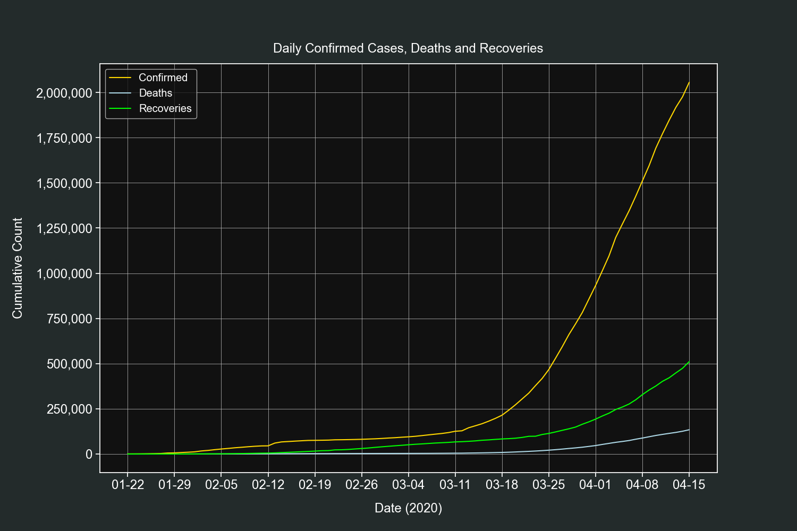
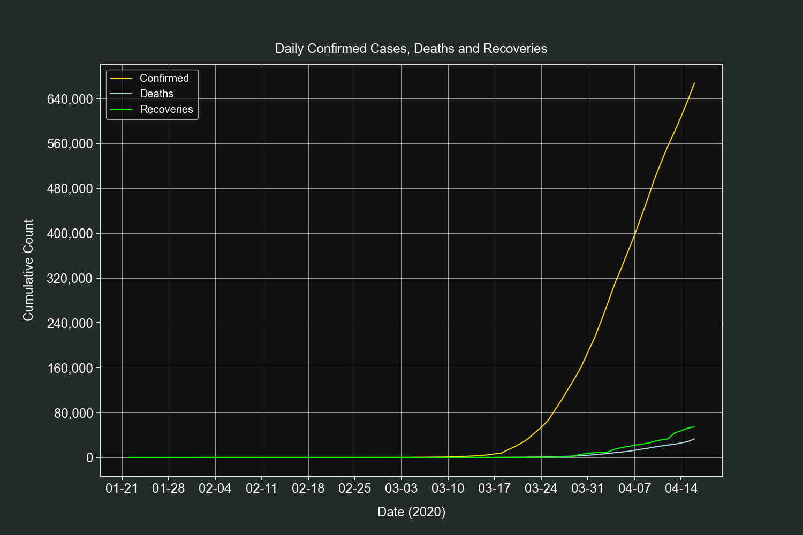
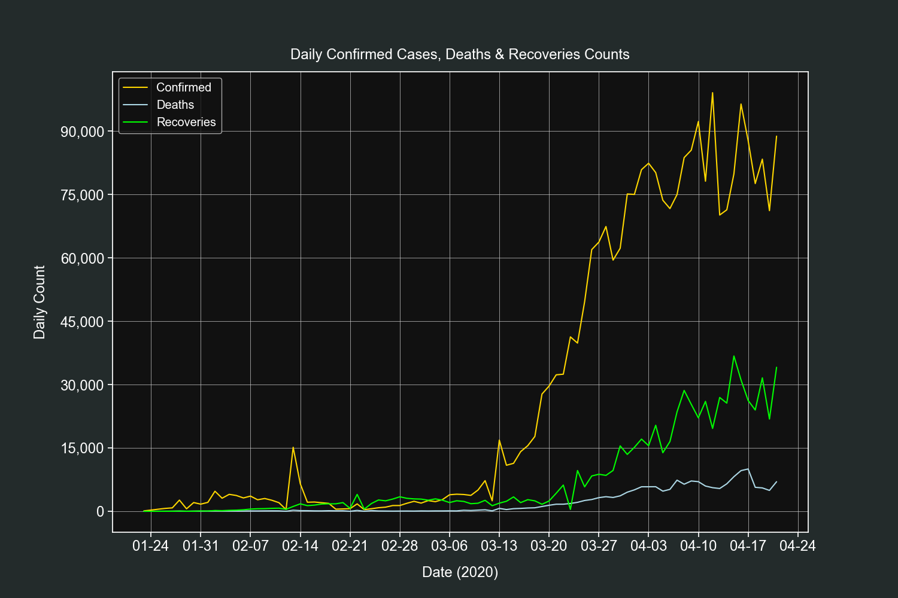
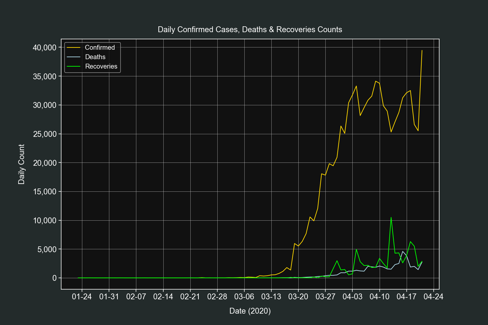
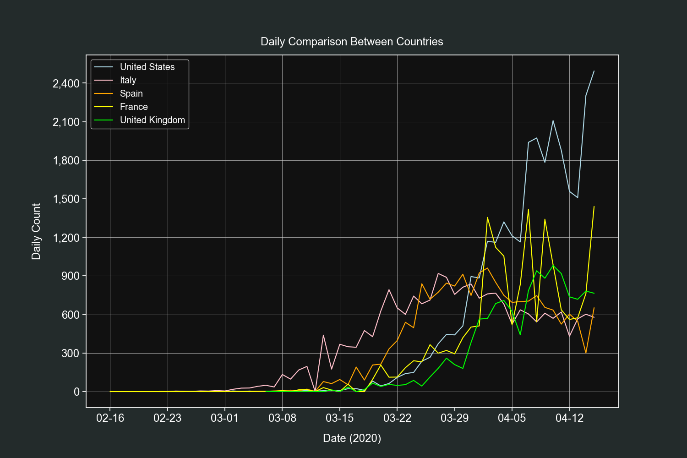
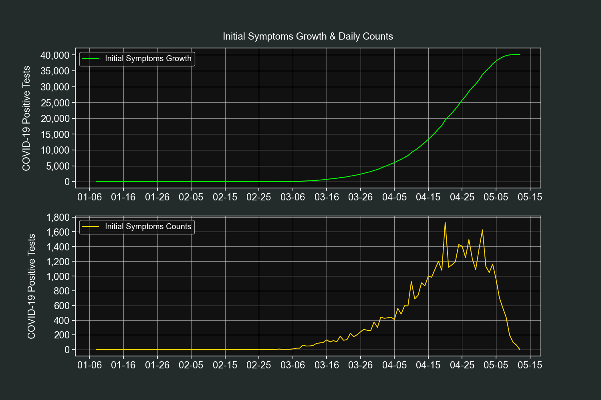
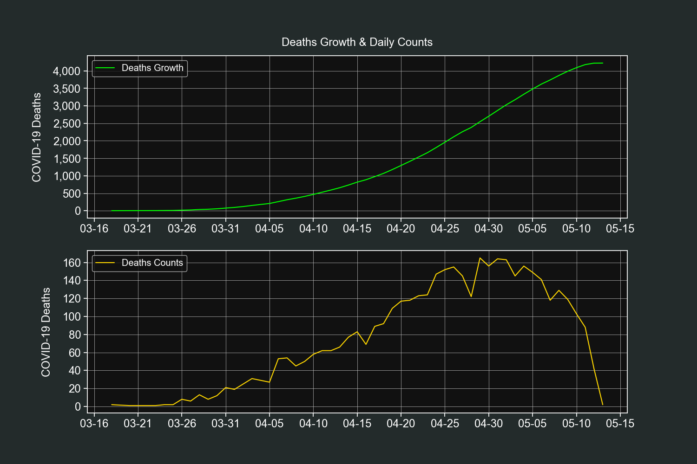
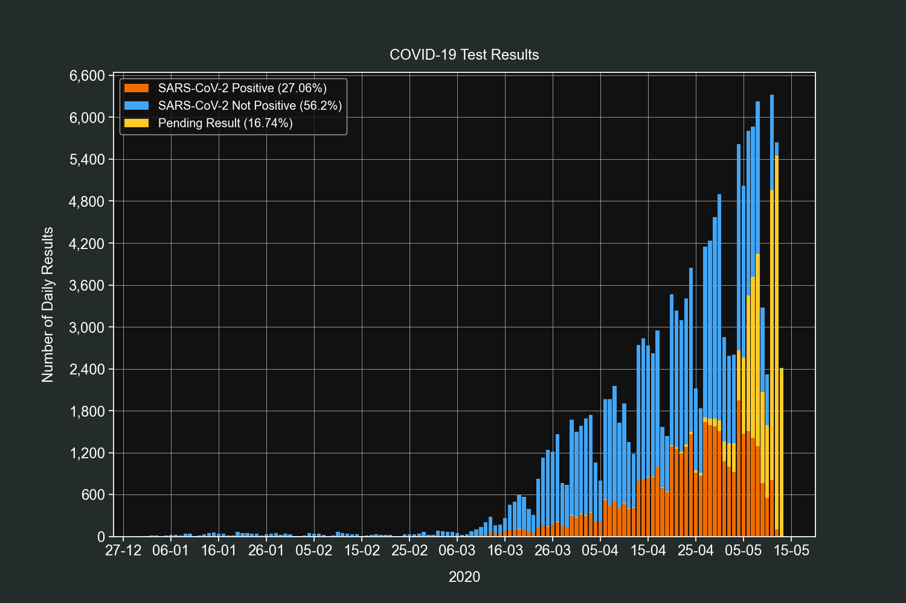
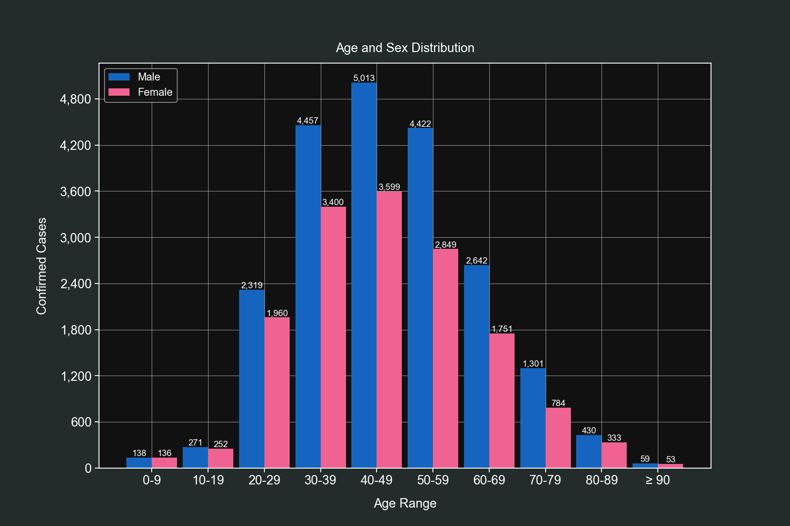

# COVID-19

This project contains scripts that collect and transform datasets of the COVID-19 pandemic for global and Mexican data. It also contains examples that explain the ETL and EDA process.

The following are the summaries of the included scripts:

* step1_global.py - A Python script that downloads and merges datasets from the Johns Hopkins repository.

* step1_mx.py - A Python script that downloads a Mexican CSC file and associated .xlsx catalog and merges them into a new CSV file.

* step2_global.py - A Python script containing several functions to create plots and get insights from the global dataset.

* step2_mx.py - A Python script containing several functions to create plots and get insights from the Mexican dataset.

# Requirements

This project uses the following Python libraries

* requests - For downloading PDF and CSV files.
* openpyxl - For reading .xlsx files.
* pandas - For performing data analysis.
* NumPy - For fast matrix operations.
* Matplotlib - For creating plots.
* seaborn - Used to prettify Matplotlib plots.

# ETL Process

Data is not always presented in the most optimal way, this is why we need to pass it through a transformation process.

I'm interested in both global and Mexican specific data (my country). Let's start with the global one.

## Global Data

The university of Johns Hopkins provides various datasets that contain global data of the COVID-19 pandemic that are daily updated.

Our goal is to merge the time-series datasets into one CSV file.

The first thing to do is to define the CSV urls and their kind.

```python
CSV_FILES = {
    "confirmed": "https://raw.githubusercontent.com/CSSEGISandData/COVID-19/master/csse_covid_19_data/csse_covid_19_time_series/time_series_covid19_confirmed_global.csv",
    "deaths": "https://raw.githubusercontent.com/CSSEGISandData/COVID-19/master/csse_covid_19_data/csse_covid_19_time_series/time_series_covid19_deaths_global.csv",
    "recovered": "https://raw.githubusercontent.com/CSSEGISandData/COVID-19/master/csse_covid_19_data/csse_covid_19_time_series/time_series_covid19_recovered_global.csv"
}
```

These CSV files have the same structure, the columns are the dates and the index are the countries/regions names.

In my experience it is better to have a datetime index than a string one. This is because `pandas` has great support for time-series data.

We have a small problem though, we don't know how many columns we will have since they add a new one each day.

What we will do is to first 'scout' one of the CSV files and create a skeleton dict that will then be filled with the real data.

```python

# Initialize the skeleton dict.
data_dict = dict()

# This dictionary will hold all our available dates.
dates_dict = dict()

# This set will hold all the countries/regions we find.
countries = set()

# We will load the first CSV url.
file = list(CSV_FILES.values())[0]

with requests.get(file) as response:

    # Pass the response text into a csv.DictReader object.
    reader = csv.DictReader(response.text.splitlines())

    # Extract the header row and select from the fifth column onwards.
    fields = reader.fieldnames[4:]

    # Convert the header row dates to datetime objects.
    for field in fields:
        dates_dict[field] = "{:%Y-%m-%d}".format(
            datetime.strptime(field, "%m/%d/%y"))

    # Extract the countries/regions by iterating over all rows.
    for row in reader:
        countries.add(row["Country/Region"])

    # Convert the countries set to a list and sort it.
    countries = sorted(list(countries))

    # Combine every date with every country and fill it with zero values.
    for date in dates_dict.values():

        for country in countries:

            temp_key = "{}_{}".format(date, country)
            data_dict[temp_key] = [0, 0, 0]
```

Once this code is run we end up having a dict similar to this one.

```python
{
    '2020-01-22_Afghanistan': [0, 0, 0],
    '2020-01-22_Albania': [0, 0, 0],
    '2020-01-22_Algeria': [0, 0, 0]
}
```

The underscore is added so we can later split back the key into its two original values.

Each country will have zero values for each date we find. The drawback is that we will end with several rows with zero values but that's really easy fo filter out with `pandas`.

Once we have our skeleton dict ready we can start filling it with real data.

We will load the 3 CSV files and check each row to see if it matches with our skeleton dict and then update the corresponding column.

```python
# Iterate over our 3 urls.
for kind, url in CSV_FILES.items():

    with requests.get(url) as response:

        # Pass the response text into a csv.DictReader object.
        reader = csv.DictReader(response.text.splitlines())

        # Iterate over each row of the CSV file.
        for row in reader:

            # Iterate over our available dates.
            for k, v in dates_dict.items():

                # Construct the key for our look up.
                temp_key = "{}_{}".format(v, row["Country/Region"])

                # Update the corresponding value depending on the CSV data kind.
                if kind == "confirmed":
                    data_dict[temp_key][0] += int(row[k])
                elif kind == "deaths":
                    data_dict[temp_key][1] += int(row[k])
                elif kind == "recovered":
                    data_dict[temp_key][2] += int(row[k])

# Save our data to a CSV file.
with open("global_data.csv", "w", encoding="utf-8", newline="") as other_file:

    # Initialize the data list with the header row.
    data_list = data_list = [
        ["isodate", "country", "confirmed", "deaths", "recovered"]]

    # Iterate over our data dict and pass the values to the data list.
    for k, v in data_dict.items():
        isodate, country = k.split("_")
        data_list.append([isodate, country, v[0], v[1], v[2]])

    csv.writer(other_file).writerows(data_list)
```

Now we have our CSV file saved on our computer, ready to be analyzed.

## Mexican Data

The Mexican government provides an encoded CSV file and its assorted catalog file to decode it. combining these two files gives us a new CSV file that contains all the information in a clean way.

We start by defining the urls and their respective file names.


```python
DATA_URL = "http://187.191.75.115/gobmx/salud/datos_abiertos/datos_abiertos_covid19.zip"
DATA_FILE = "./data.zip"

CATALOG_URL = "http://187.191.75.115/gobmx/salud/datos_abiertos/diccionario_datos_covid19.zip"
CATALOG_FILE = "./catalog.zip"
```

Afterwards we use the `requests` library to download both.

```python
with requests.get(DATA_URL) as response:

    with open(DATA_FILE, "wb") as temp_file:
        temp_file.write(response.content)

with requests.get(CATALOG_URL) as response:

    with open(CATALOG_FILE, "wb") as temp_file:
        temp_file.write(response.content)
```

Now that we have both files downloaded we can start combining them. The first thing to do is to convert each sheet from the catalog workbook into a `dict`.

We start by loading into memory the catalog file from the ZIP file.

```python
with zipfile.ZipFile(CATALOG_FILE) as catalog_zip:
    print("Reading catalog file...")

    with catalog_zip.open(catalog_zip.namelist()[0]) as cat_file:
        print("Processing catalog file...")

        workbook = load_workbook(io.BytesIO(
            cat_file.read()), read_only=True)
```

Now we feed the dictionaries with the values from each sheet; since they all are very similar and there are too many I will only show you one of them.

```python
# Load the specified sheet by name.
sheet = workbook["Catálogo ORIGEN"]

# Iterate over all the sheet's available rows.
for row in sheet.rows:
    ORIGEN_DICT[str(row[0].value)] = str(row[1].value).strip()
```

At this point we have 9 dictionaries containing all the data from the workbook. The next step is to read the original CSV file and replace the encoded values with the real ones.

```python
# This list will hold our rows data.
data_list = list()

with zipfile.ZipFile(DATA_FILE) as data_zip:
    print("Reading CSV file...")

    with data_zip.open(data_zip.namelist()[0], "r") as csv_file:
        print("Procesing CSV file...")

        reader = csv.DictReader(
            io.TextIOWrapper(csv_file, encoding="latin-1"))

        # We start iterating over all the CSV rows.
        for row in reader:
```

We update the values from each row with the real ones using their corresponding dictionaries by passing the original value as the key. I will show you a few examples of how each column is updated.

```python
row["ENTIDAD_UM"] = ENTIDADES_DICT[row["ENTIDAD_UM"]]
row["ORIGEN"] = ORIGEN_DICT[row["ORIGEN"]]
row["SECTOR"] = SECTOR_DICT[row["SECTOR"]]
row["SEXO"] = SEXO_DICT[row["SEXO"]]
row["TIPO_PACIENTE"] = TIPO_PACIENTE_DICT[row["TIPO_PACIENTE"]]
row["NACIONALIDAD"] = NACIONALIDAD_DICT[row["NACIONALIDAD"]]
row["RESULTADO"] = RESULTADO_DICT[row["RESULTADO"]]
```

After the row is updated we add it to our `data_list`.

```python
data_list.append(row)
```

Once we finish processing all rows we simply save the `data_list` to a CSV file using a `csv.DictWriter` object.

```python
with open("./mx_data.csv", "w", encoding="utf-8", newline="") as result_csv:
    writer = csv.DictWriter(result_csv, reader.fieldnames)
    writer.writeheader()
    writer.writerows(data_list)
    print("Dataset saved.")
```

And finally, we delete the ZIP files we downloaded and we end up only with the complete CSV file.

```python
os.remove(DATA_FILE)
os.remove(CATALOG_FILE)
```

# Data Analysis

Now we have 2 CSV files ready to be analyzed and plotted, `global_data.csv` and `casos_confirmados.csv`.

We are going to use `pandas`, `NumPy`, `Matplotlib` and `seaborn`. We will start by importing the required libraries and setting up the styles for our plots.


```python
import matplotlib.dates as mdates
import matplotlib.pyplot as plt
import matplotlib.ticker as ticker
import numpy as np
import pandas as pd
import seaborn as sns


sns.set(style="ticks",
        rc={
            "figure.figsize": [15, 10],
            "text.color": "white",
            "legend.fontsize": "large",
            "xtick.labelsize": "x-large",
            "ytick.labelsize": "x-large",
            "axes.labelsize": "x-large",
            "axes.titlesize": "x-large",
            "axes.labelcolor": "white",
            "axes.edgecolor": "white",
            "xtick.color": "white",
            "ytick.color": "white",
            "axes.facecolor": "#111111",
            "figure.facecolor": "#232b2b"}
        )
```

These styles will apply an elegant dark gray palette to our plots.

*Note: You will have different numbers on your results as I did this analysis on older datasets.*

## Global Data

We start by loading our dataset and specifying the first column as our index, this will turn it into a `datetimeindex` which is very handy when working with time-series data.

```python
df = pd.read_csv("global_data.csv", parse_dates=["isodate"], index_col=0)
```

Let's take a look at our `DataFrame` using the `head()`, `tail()` and `describe()` methods.

```python
df.head()
```

| | country | confirmed | deaths |  recovered |
| --- | --- | --- | --- | --- |
| isodate | | | |
| 2020-01-22 | Afghanistan | 0 | 0 | 0 |
| 2020-01-22 | Albania | 0 | 0 | 0 |
| 2020-01-22 | Algeria | 0 | 0 | 0 |
| 2020-01-22 | Andorra | 0 | 0 | 0 |
| 2020-01-22 | Angola | 0 | 0 | 0 |

```python
df.tail()
```

| isodate             | country            |   confirmed |   deaths |   recovered |
|:--------------------|:-------------------|------------:|---------:|------------:|
| 2020-04-14 | West Bank and Gaza |         308 |        2 |          62 |
| 2020-04-14 | Western Sahara     |           6 |        0 |           0 |
| 2020-04-14 | Yemen              |           1 |        0 |           0 |
| 2020-04-14 | Zambia             |          45 |        2 |          30 |
| 2020-04-14 | Zimbabwe           |          17 |        3 |           0 |

```python
df.describe()
```

|       |   confirmed |    deaths |   recovered |
|:------|------------:|----------:|------------:|
| count |    15540    | 15540     |   15540     |
| mean  |     2007.55 |   105.364 |     489.394 |
| std   |    16754    |   998.927 |    4630.27  |
| min   |        0    |     0     |       0     |
| 25%   |        0    |     0     |       0     |
| 50%   |        1    |     0     |       0     |
| 75%   |       53    |     1     |       2     |
| max   |   607670    | 25832     |   78200     |

We can observe the countries are alphabetically sorted and our `datetimeindex` worked correctly.

We can also observe all the first rows have zero values, as predicted from the ETL process. This caused an adverse effect on the `describe()` method, where the results are biased towards zero.

Let's fix this by removing all rows with zero values on their confirmed field.

```python
df = df[df["confirmed"] > 0]
df.describe()
```

|       |   confirmed |    deaths |   recovered |
|:------|------------:|----------:|------------:|
| count |     7793    |  7793     |    7793     |
| mean  |     4003.25 |   210.107 |     975.898 |
| std   |    23490.1  |  1402.83  |    6502.32  |
| min   |        1    |     0     |       0     |
| 25%   |        7    |     0     |       0     |
| 50%   |       52    |     1     |       2     |
| 75%   |      541    |     7     |      32     |
| max   |   607670    | 25832     |   78200     |

This looks better and more accurate. On the next sections we will start producing interesting insights.

### Top 10 Countries by Confirmed Cases, Deaths & Recoveries

To get the countries with the highest values we first need to group our `DataFrame` by the country field and select their max value which happens to be the latest one.

```python
grouped_df = df.groupby("country").max()
```

Once grouped we use the `sort_values()` method on the field we are interested in and sort by descending order. From there we print the first 10 rows from the field we previously defined.

```python
# Confirmed cases
print(grouped_df.sort_values("confirmed", ascending=False)["confirmed"][:10])
```

| country        |   confirmed |
|:---------------|------------:|
| US             |      607670 |
| Spain          |      172541 |
| Italy          |      162488 |
| France         |      137875 |
| Germany        |      131359 |
| United Kingdom |       94845 |
| China          |       83306 |
| Iran           |       74877 |
| Turkey         |       65111 |
| Belgium        |       31119 |

```python
# Deaths
print(grouped_df.sort_values("deaths", ascending=False)["deaths"][:10])
```

| country        |   deaths |
|:---------------|---------:|
| US             |    25832 |
| Italy          |    21067 |
| Spain          |    18056 |
| France         |    15748 |
| United Kingdom |    12129 |
| Iran           |     4683 |
| Belgium        |     4157 |
| China          |     3345 |
| Germany        |     3294 |
| Netherlands    |     2955 |

```python
# Recoveries
print(grouped_df.sort_values("recovered", ascending=False)["recovered"][:10])
```

| country     |   recovered |
|:------------|------------:|
| China       |       78200 |
| Germany     |       68200 |
| Spain       |       67504 |
| Iran        |       48129 |
| US          |       47763 |
| Italy       |       37130 |
| France      |       29098 |
| Switzerland |       13700 |
| Canada      |        8210 |
| Austria     |        7633 |

### Daily Global Confirmed Cases, Deaths or Recoveries

Thanks fo the `datetimeindex` knowing the daily totals is really easy. We will only require to resample our `DataFrame` by 1 day intervals.

We will start by defining our field (`confirmed`, `deaths` or `recovered`) and resampling method.

```python
field = "deaths"
resampled_df = df.resample("D").sum()
```

We add 2 new columns to know the daily field totals (`difference`) and their percent change (`change`).

```python
resampled_df["difference"] = resampled_df[field].diff()
resampled_df["change"] = resampled_df["difference"].pct_change()
```

Now we drop `NaN` values, we do this so the next step doesn't crash the script.

```python
resampled_df.dropna(inplace=True)
```

This step is optional, the purpose of it is to display the results in a more human readable way.

The `difference` column gets converted from `float` to `int` and the `change` column gets some string formatting, which includes adding a percent sign and rounding up the numbers to the second decimal.

```python
resampled_df["difference"] = resampled_df["difference"].apply(int)

resampled_df["change"] = resampled_df["change"].apply(
    lambda x: str(np.round(x * 100, 2)) + "%")
```

And finally, we print the latest 10 rows.

```python
print(resampled_df[[field, "difference", "change"]][-10:])
```

| isodate             |   deaths |   difference | change   |
|:--------------------|---------:|-------------:|:---------|
| 2020-04-05 |    69374 |         4768 | -18.06%  |
| 2020-04-06 |    74565 |         5191 | 8.87%    |
| 2020-04-07 |    81865 |         7300 | 40.63%   |
| 2020-04-08 |    88338 |         6473 | -11.33%  |
| 2020-04-09 |    95455 |         7117 | 9.95%    |
| 2020-04-10 |   102525 |         7070 | -0.66%   |
| 2020-04-11 |   108503 |         5978 | -15.45%  |
| 2020-04-12 |   114091 |         5588 | -6.52%   |
| 2020-04-13 |   119482 |         5391 | -3.53%   |
| 2020-04-14 |   125984 |         6502 | 20.61%   |

### Daily Confirmed Cases, Deaths or Recoveries for any Country

Now we will know the daily confirmed cases, deaths or recoveries and their growth for any given country. We will use the US for this example.

We start by defining the country and which field we want (`confirmed`, `deaths` or `recovered`). Afterwards we filter our `DataFrame` so it only includes values of that country.

```python
field = "deaths"
country = "US"
filtered_df = df[df["country"] == country].copy()
```

We add 2 new columns to know the daily field totals (`difference`) and their percent change (`change`).

```python
filtered_df["difference"] = filtered_df[field].diff()
filtered_df["change"] = filtered_df["difference"].pct_change()
```

Now we drop `NaN` values, we do this so the next step doesn't crash the script.

```python
filtered_df.dropna(inplace=True)
```

This step is optional, the purpose of it is to display the results in a more human readable way.

The `difference` column gets converted from `float` to `int` and the `change` column gets some string formatting, which includes adding a percent sign and rounding up the numbers to the second decimal.

```python
filtered_df["difference"] = filtered_df["difference"].apply(int)

filtered_df["change"] = filtered_df["change"].apply(
    lambda x: str(np.round(x * 100, 2)) + "%")
```

And finally, we print the latest 10 rows.

```python
print(filtered_df[[field, "difference", "change"]][-10:])
```

| isodate             |   deaths |   difference | change   |
|:--------------------|---------:|-------------:|:---------|
| 2020-04-05 |     9619 |         1212 | -8.18%   |
| 2020-04-06 |    10783 |         1164 | -3.96%   |
| 2020-04-07 |    12722 |         1939 | 66.58%   |
| 2020-04-08 |    14695 |         1973 | 1.75%    |
| 2020-04-09 |    16478 |         1783 | -9.63%   |
| 2020-04-10 |    18586 |         2108 | 18.23%   |
| 2020-04-11 |    20463 |         1877 | -10.96%  |
| 2020-04-12 |    22020 |         1557 | -17.05%  |
| 2020-04-13 |    23529 |         1509 | -3.08%   |
| 2020-04-14 |    25832 |         2303 | 52.62%   |

Feel free to try this example with other country names, such as Italy, Spain or Iran.

### Days from 100 to 3,200 Confirmed Cases

This one is quite interesting, we will know how many days it took to reach from 100 to 3,200 confirmed cases.

For this exercise we will use custom bins for the exponential growth (100-199, 200-399, and so on).

We start by removing all rows lower than 100 confirmed cases.

```python
df = df[df["confirmed"] >= 100]
```

We define our bins and their labels.

```python
bins = [(100, 199), (200, 399), (400, 799), (800, 1599), (1600, 3200)]
labels = ["100-199", "200-399", "400-799", "800-1599", "1600-3200"]
```

We extract all the available countries in the dataset.

```python
all_countries = sorted(df["country"].unique().tolist())
```

These lists will be filled with values in the next step.

```python
valid_countries = list()
data_list = list()
```

We iterate over all the countries we have and create temporary `DataFrames` with them.

```python
for country in all_countries:

    temp_df = df[df["country"] == country]

    # Only process countries if their confirmed cases are equal or greater than 3,200.
    if temp_df["confirmed"].max() >= 3200:
        temp_list = list()

        # We iterate over our bins and count how many days each one has.
        for item in bins:
            temp_list.append(temp_df[(temp_df["confirmed"] >= item[0]) & (
                temp_df["confirmed"] <= item[1])]["confirmed"].count())

        data_list.append(temp_list)
        valid_countries.append(country)
```

We create a final `DataFrame` with the results and add a new column with the total days from 100 to 3,200 confirmed cases.

```python
final_df = pd.DataFrame(data_list, index=valid_countries, columns=labels)
final_df["total"] = final_df.sum(axis=1)
print(final_df)
```

|                      |   100-199 |   200-399 |   400-799 |   800-1599 |   1600-3200 |   total |
|:---------------------|----------:|----------:|----------:|-----------:|------------:|--------:|
| Australia            |         3 |         4 |         4 |          2 |           5 |      18 |
| Austria              |         3 |         2 |         2 |          3 |           4 |      14 |
| Belarus              |         3 |         2 |         3 |          3 |           4 |      15 |
| Belgium              |         2 |         5 |         2 |          4 |           3 |      16 |
| Brazil               |         3 |         3 |         2 |          2 |           4 |      14 |
| Canada               |         4 |         1 |         3 |          4 |           2 |      14 |
| Chile                |         1 |         3 |         4 |          3 |           6 |      17 |
| China                |         0 |         0 |         2 |          2 |           2 |       6 |
| Czechia              |         2 |         3 |         2 |          5 |           6 |      18 |
| Denmark              |         0 |         1 |         2 |         11 |           8 |      22 |
| Dominican Republic   |         1 |         4 |         3 |          7 |           9 |      24 |
| Ecuador              |         2 |         1 |         2 |          5 |           6 |      16 |
| France               |         3 |         3 |         1 |          3 |           3 |      13 |
| Germany              |         3 |         1 |         3 |          3 |           2 |      12 |
| India                |         6 |         3 |         4 |          5 |           4 |      22 |
| Indonesia            |         3 |         3 |         5 |          6 |           8 |      25 |
| Iran                 |         1 |         2 |         1 |          2 |           2 |       8 |
| Ireland              |         3 |         2 |         3 |          4 |           5 |      17 |
| Israel               |         3 |         4 |         3 |          3 |           3 |      16 |
| Italy                |         1 |         2 |         2 |          2 |           4 |      11 |
| Japan                |         6 |         8 |         9 |         13 |           9 |      45 |
| Korea, South         |         1 |         1 |         2 |          3 |           3 |      10 |
| Luxembourg           |         1 |         2 |         3 |          4 |          14 |      24 |
| Malaysia             |         5 |         1 |         4 |          5 |          10 |      25 |
| Mexico               |         2 |         4 |         4 |          6 |           6 |      22 |
| Netherlands          |         2 |         3 |         2 |          4 |           4 |      15 |
| Norway               |         3 |         1 |         3 |          6 |           7 |      20 |
| Pakistan             |         1 |         2 |         4 |          7 |           7 |      21 |
| Panama               |         2 |         4 |         4 |          6 |           8 |      24 |
| Peru                 |         2 |         5 |         5 |          6 |           4 |      22 |
| Philippines          |         4 |         5 |         4 |          4 |           5 |      22 |
| Poland               |         3 |         3 |         4 |          4 |           6 |      20 |
| Portugal             |         2 |         2 |         3 |          2 |           4 |      13 |
| Qatar                |         0 |         4 |        17 |          4 |           8 |      33 |
| Romania              |         4 |         4 |         3 |          4 |           6 |      21 |
| Russia               |         3 |         3 |         3 |          4 |           3 |      16 |
| Saudi Arabia         |         5 |         3 |         3 |          7 |           8 |      26 |
| Serbia               |         3 |         5 |         4 |          4 |           7 |      23 |
| Singapore            |        13 |         8 |         7 |         11 |           6 |      45 |
| Spain                |         2 |         2 |         3 |          1 |           3 |      11 |
| Sweden               |         2 |         3 |         2 |          7 |           8 |      22 |
| Switzerland          |         1 |         4 |         3 |          2 |           4 |      14 |
| Turkey               |         1 |         1 |         1 |          2 |           2 |       7 |
| US                   |         2 |         2 |         3 |          2 |           3 |      12 |
| Ukraine              |         2 |         2 |         4 |          6 |           6 |      20 |
| United Arab Emirates |         6 |         3 |         5 |          4 |           5 |      23 |
| United Kingdom       |         2 |         4 |         2 |          4 | 

### Daily Global Growth

Let's start the plots section with a straightforward one. We will plot the daily growth of confirmed cases, deaths and recoveries of all countries combined.

We will filter out rows with zero confirmed cases.

```python
df = df[df["confirmed"] > 0]
```

Resample the data by 1 day intervals and sum the daily totals.

```python
resampled_df = df.resample("D").sum()
```

Create 3 line plots on the same axis, one for each field.

```python
fig, ax = plt.subplots()

ax.plot(resampled_df.index,
        resampled_df["confirmed"], label="Confirmed", color="gold")

ax.plot(resampled_df.index,
        resampled_df["deaths"], label="Deaths", color="lightblue")

ax.plot(resampled_df.index,
        resampled_df["recovered"], label="Recoveries", color="lime")
```

Customize our tickers.

```python
ax.xaxis.set_major_locator(mdates.DayLocator(interval=7))
ax.xaxis.set_major_formatter(mdates.DateFormatter("%m-%d"))
ax.yaxis.set_major_locator(ticker.MaxNLocator())
ax.yaxis.set_major_formatter(ticker.StrMethodFormatter("{x:,.0f}"))
```

Add final customizations.

```python
plt.grid(linewidth=0.5)
plt.legend(loc=2)
plt.title("Daily Confirmed Cases, Deaths & Recoveries", pad=15)
plt.xlabel("Date (2020)", labelpad=15)
plt.ylabel("Cumulative Count", labelpad=15)

plt.show()
```



### Daily Growth for any Country

This plot is very similar to the previous one, the only difference is that it shows the daily growth only for one country, in this example it will be the US.

We filter out rows with zero confirmed cases and only select rows that belong to the country we defined.

```python
country = "US"
df = df[(df["confirmed"] > 0) & (df["country"] == country)]
```

Create 3 line plots on the same axis, one for each field.

```python
fig, ax = plt.subplots()

ax.plot(df.index, df["confirmed"], label="Confirmed", color="gold")
ax.plot(df.index, df["deaths"], label="Deaths", color="lightblue")
ax.plot(df.index, df["recovered"], label="Recoveries", color="lime")
```

Customize our tickers.

```python
ax.xaxis.set_major_locator(mdates.DayLocator(interval=7))
ax.xaxis.set_major_formatter(mdates.DateFormatter("%m-%d"))
ax.yaxis.set_major_locator(ticker.MaxNLocator())
ax.yaxis.set_major_formatter(ticker.StrMethodFormatter("{x:,.0f}"))
```

Add final customizations.

```python
plt.grid(linewidth=0.5)
plt.legend(loc=2)
plt.title("Daily Confirmed Cases, Deaths & Recoveries", pad=15)
plt.xlabel("Date (2020)", labelpad=15)
plt.ylabel("Cumulative Count", labelpad=15)

plt.show()
```



### Daily Global Counts

This plot is simlar to the previous one, it will show us the daily counts of confirmed cases, deaths and recoveries for all the countries combined.

We filter out rows with zero confirmed cases.

```python
df = df[df["confirmed"] > 0]
```

Resample the data by 1 day intervals and sum the daily totals.

```python
resampled_df = df.resample("D").sum()
```

Add 3 new columns, one for each field counts.

```python
resampled_df["confirmed_difference"] = resampled_df["confirmed"].diff()
resampled_df["deaths_difference"] = resampled_df["deaths"].diff()
resampled_df["recovered_difference"] = resampled_df["recovered"].diff()
```

Create 3 line plots on the same axis, one for each field counts.

```python
fig, ax = plt.subplots()

ax.plot(resampled_df.index,
        resampled_df["confirmed_difference"], label="Confirmed", color="gold")

ax.plot(resampled_df.index,
        resampled_df["deaths_difference"], label="Deaths", color="lightblue")

ax.plot(resampled_df.index,
        resampled_df["recovered_difference"], label="Recoveries", color="lime")
```

Customize our tickers.

```python
ax.xaxis.set_major_locator(mdates.DayLocator(interval=7))
ax.xaxis.set_major_formatter(mdates.DateFormatter("%m-%d"))
ax.yaxis.set_major_locator(ticker.MaxNLocator())
ax.yaxis.set_major_formatter(ticker.StrMethodFormatter("{x:,.0f}"))
```

Add final customizations.

```python
plt.grid(linewidth=0.5)
plt.legend(loc=2)
plt.title("Daily Confirmed Cases, Deaths & Recoveries", pad=15)
plt.xlabel("Date (2020)", labelpad=15)
plt.ylabel("Daily Count", labelpad=15)

plt.show()
```



### Daily Counts for any Country

This plot is very similar to the previous one, the only difference is that it shows the daily counts only for one country, in this example it will be the US.

We filter out rows with zero confirmed cases and only select rows that belong to the country we defined.

```python
country = "US"
df = df[(df["confirmed"] > 0) & (df["country"] == country)].copy()
```

Add 3 new columns, one for each field counts.

```python
df["confirmed_difference"] = df["confirmed"].diff()
df["deaths_difference"] = df["deaths"].diff()
df["recovered_difference"] = df["recovered"].diff()
```

Create 3 line plots on the same axis, one for each field counts.

```python
fig, ax = plt.subplots()

ax.plot(df.index, df["confirmed_difference"],
        label="Confirmed", color="gold")
ax.plot(df.index, df["deaths_difference"],
        label="Deaths", color="lightblue")
ax.plot(df.index, df["recovered_difference"],
        label="Recoveries", color="lime")
```

Customize our tickers.

```python
ax.xaxis.set_major_locator(mdates.DayLocator(interval=7))
ax.xaxis.set_major_formatter(mdates.DateFormatter("%m-%d"))
ax.yaxis.set_major_locator(ticker.MaxNLocator())
ax.yaxis.set_major_formatter(ticker.StrMethodFormatter("{x:,.0f}"))
```

Add final customizations.

```python
plt.grid(linewidth=0.5)
plt.legend(loc=2)
plt.title("Daily Confirmed Cases, Deaths & Recoveries Counts", pad=15)
plt.xlabel("Date (2020)", labelpad=15)
plt.ylabel("Daily Count", labelpad=15)

plt.show()
```



### Daily Counts Comparison

This plot will compare the daily counts of the field we define between the countries we want.

We will start by defining a dictionary of countries, their labels and colors for their lines.

```python
COUNTRIES = [
    ["US", "United States", "lightblue"],
    ["Italy", "Italy", "pink"],
    ["Spain", "Spain", "orange"],
    ["France", "France", "yellow"],
    ["United Kingdom", "United Kingdom", "lime"]
]
```

Then we will define the field and remove all 0 values from the `DataFrame`.

```python
field = "deaths"
df = df[df[field] > 0]
```

Create a line plot for each country and add it to the same axis.

```python
fig, ax = plt.subplots()

for country in COUNTRIES:
    temp_df = df[df["country"] == country[0]].copy()
    temp_df["difference"] = temp_df[field].diff()

    ax.plot(temp_df.index, temp_df["difference"],
            label=country[1], color=country[2])
```

Customize our tickers.

```python
ax.xaxis.set_major_locator(mdates.DayLocator(interval=7))
ax.xaxis.set_major_formatter(mdates.DateFormatter("%m-%d"))
ax.yaxis.set_major_locator(ticker.MaxNLocator())
ax.yaxis.set_major_formatter(ticker.StrMethodFormatter("{x:,.0f}"))
```

Add final customizations.

```python
ax.grid(linewidth=0.5)
ax.legend(loc=2)
plt.title("Daily Comparison Between Countries", pad=15)
plt.xlabel("Date (2020)", labelpad=15)
plt.ylabel("Daily Count", labelpad=15)

plt.show()
```



If's fascinating how much insights we got from only 5 fields (date, country, confirmed, deaths and recoveries).

This is the end for the global data section, coming next is the Mexican dataset.

## Mexican Data

We start by loading our dataset with no special parameters.

```python
df = pd.read_csv("mx_data.csv")
```

We would normally use the `head()`, `tail()` and `describe()` methods to take a look at our `DataFrame` but since this one has several columns it breaks the Markdown.

Instead of that I will briefly describe what's inside this `DataFrame`:

* We have 4 datetime fields which are: latest update, date of entry, date of first symptoms and date of death.

* Several fields of preconditions, such as pregnancy, overweight, hypertension, diabetes.

* State and municipality of residence.

* Current status of the patient test (confirmed COVID-19, not convirmed COVID-19 and pending result).

* Age and gender.

We are going to use some of these fields on the next sections.

### Confirmed Cases by State

Mexico has 32 states and as of now all of them have confirmed cases.

To know how many tests each state has made we will use the `value_counts()` method on the `ENTIDAD_RES` column.

```python
print(df["ENTIDAD_RES"].value_counts())
```

|                                 |   ENTIDAD_RES |
|:--------------------------------|--------------:|
| CIUDAD DE MÉXICO                |         33657 |
| MÉXICO                          |         23349 |
| NUEVO LEÓN                      |          8418 |
| JALISCO                         |          7920 |
| GUANAJUATO                      |          7587 |
| BAJA CALIFORNIA                 |          5420 |
| COAHUILA DE ZARAGOZA            |          5243 |
| VERACRUZ DE IGNACIO DE LA LLAVE |          4410 |
| TABASCO                         |          4336 |
| SINALOA                         |          4126 |
| TAMAULIPAS                      |          4099 |
| PUEBLA                          |          3766 |
| MICHOACÁN DE OCAMPO             |          3280 |
| AGUASCALIENTES                  |          3086 |
| YUCATÁN                         |          2923 |
| SAN LUIS POTOSÍ                 |          2628 |
| SONORA                          |          2580 |
| CHIHUAHUA                       |          2294 |
| QUINTANA ROO                    |          2267 |
| GUERRERO                        |          2054 |
| MORELOS                         |          1955 |
| HIDALGO                         |          1716 |
| TLAXCALA                        |          1611 |
| BAJA CALIFORNIA SUR             |          1558 |
| CHIAPAS                         |          1401 |
| DURANGO                         |          1269 |
| QUERÉTARO                       |          1268 |
| OAXACA                          |          1207 |
| ZACATECAS                       |          1057 |
| NAYARIT                         |           981 |
| CAMPECHE                        |           702 |
| COLIMA                          |           329 |

The state with most tests done is the capital of the country (Mexico City).

What we are really interested in are confirmed COVID-19 cases, we will make a simple filter and use the `value_counts()` method again.

```python
print(df[df["RESULTADO"] == "Positivo SARS-CoV-2"]["ENTIDAD_RES"].value_counts())
```

|                                 |   ENTIDAD_RES |
|:--------------------------------|--------------:|
| CIUDAD DE MÉXICO                |         10946 |
| MÉXICO                          |          6813 |
| BAJA CALIFORNIA                 |          2764 |
| TABASCO                         |          1976 |
| SINALOA                         |          1620 |
| VERACRUZ DE IGNACIO DE LA LLAVE |          1574 |
| PUEBLA                          |          1213 |
| QUINTANA ROO                    |          1177 |
| YUCATÁN                         |           924 |
| MORELOS                         |           915 |
| TAMAULIPAS                      |           799 |
| CHIHUAHUA                       |           768 |
| NUEVO LEÓN                      |           717 |
| JALISCO                         |           699 |
| MICHOACÁN DE OCAMPO             |           678 |
| GUERRERO                        |           670 |
| SONORA                          |           642 |
| HIDALGO                         |           637 |
| COAHUILA DE ZARAGOZA            |           616 |
| GUANAJUATO                      |           580 |
| CHIAPAS                         |           450 |
| TLAXCALA                        |           438 |
| BAJA CALIFORNIA SUR             |           409 |
| AGUASCALIENTES                  |           398 |
| SAN LUIS POTOSÍ                 |           338 |
| QUERÉTARO                       |           315 |
| OAXACA                          |           291 |
| NAYARIT                         |           252 |
| CAMPECHE                        |           226 |
| ZACATECAS                       |           168 |
| DURANGO                         |           127 |
| COLIMA                          |            46 |

That was really simple, let's up our game and do some table pivoting and MultiIndex calculations.

We will start by only taking into account confirmed COVID-19 cases.

```python
df = df[df["RESULTADO"] == "Positivo SARS-CoV-2"]
```

We will use this value to calculate the percentages.

```python
total_cases = len(df)
```

We will pivot the table, the gender will be our columns and the state wil be our index.

```python
pivoted_df = df.pivot_table(
    index="ENTIDAD_RES", columns="SEXO", aggfunc="count")
```

We will add two new columns to this `DataFrame`, one for each gender percentage. This way we will know the total percentage of gender by state.

*Note: These new columns can be added to any other column. We choose the first one (EDAD).*

```python
pivoted_df["EDAD", "female_percentage"] = np.round(
    pivoted_df["EDAD", "MUJER"] / total_cases * 100, 2)

pivoted_df["EDAD", "male_percentage"] = np.round(
    pivoted_df["EDAD", "HOMBRE"] / total_cases * 100, 2)
```

We rename the columns so they are human readable.

```python
pivoted_df.rename(columns={"HOMBRE": "Male",
                            "MUJER": "Female",
                            "male_percentage": "Male %",
                            "female_percentage": "Female %"}, level=1, inplace=True)

print(pivoted_df["edad"])
```

| ENTIDAD_RES                     |   Male |   Female |   Female % |   Male % |
|:--------------------------------|-------:|---------:|-----------:|---------:|
| AGUASCALIENTES                  |    198 |      200 |       0.5  |     0.49 |
| BAJA CALIFORNIA                 |   1530 |     1234 |       3.07 |     3.81 |
| BAJA CALIFORNIA SUR             |    217 |      192 |       0.48 |     0.54 |
| CAMPECHE                        |    163 |       63 |       0.16 |     0.41 |
| CHIAPAS                         |    277 |      173 |       0.43 |     0.69 |
| CHIHUAHUA                       |    445 |      323 |       0.8  |     1.11 |
| CIUDAD DE MÉXICO                |   6303 |     4643 |      11.55 |    15.68 |
| COAHUILA DE ZARAGOZA            |    317 |      299 |       0.74 |     0.79 |
| COLIMA                          |     29 |       17 |       0.04 |     0.07 |
| DURANGO                         |     59 |       68 |       0.17 |     0.15 |
| GUANAJUATO                      |    313 |      267 |       0.66 |     0.78 |
| GUERRERO                        |    404 |      266 |       0.66 |     1.01 |
| HIDALGO                         |    390 |      247 |       0.61 |     0.97 |
| JALISCO                         |    423 |      276 |       0.69 |     1.05 |
| MICHOACÁN DE OCAMPO             |    401 |      277 |       0.69 |     1    |
| MORELOS                         |    554 |      361 |       0.9  |     1.38 |
| MÉXICO                          |   4021 |     2792 |       6.95 |    10.01 |
| NAYARIT                         |    130 |      122 |       0.3  |     0.32 |
| NUEVO LEÓN                      |    415 |      302 |       0.75 |     1.03 |
| OAXACA                          |    171 |      120 |       0.3  |     0.43 |
| PUEBLA                          |    728 |      485 |       1.21 |     1.81 |
| QUERÉTARO                       |    167 |      148 |       0.37 |     0.42 |
| QUINTANA ROO                    |    728 |      449 |       1.12 |     1.81 |
| SAN LUIS POTOSÍ                 |    186 |      152 |       0.38 |     0.46 |
| SINALOA                         |    896 |      724 |       1.8  |     2.23 |
| SONORA                          |    379 |      263 |       0.65 |     0.94 |
| TABASCO                         |   1155 |      821 |       2.04 |     2.87 |
| TAMAULIPAS                      |    510 |      289 |       0.72 |     1.27 |
| TLAXCALA                        |    246 |      192 |       0.48 |     0.61 |
| VERACRUZ DE IGNACIO DE LA LLAVE |    998 |      576 |       1.43 |     2.48 |
| YUCATÁN                         |    537 |      387 |       0.96 |     1.34 |
| ZACATECAS                       |     97 |       71 |       0.18 |     0.24 |

And now we have a more complete and useful table of summaries.

### Initial Symptoms Growth & Daily Counts

Let's start our plots section with a simple one. This plot will show us one aspect of the daily progression of the pandemic in Mexico.

We will plot the growth and counts when the patients had the initial symptoms of COVID-19.

We start by removing all the rows that are not COVID-19 positive.

```python
df = df[df["RESULTADO"] == "Positivo SARS-CoV-2"]
```

We group our `DataFrame` by day of initial symptoms and aggregate them by number of ocurrences.

```python
grouped_df = df.groupby("FECHA_SINTOMAS").count()
```

Convert the index to `datetimeindex`.

```python
grouped_df.index = pd.to_datetime(grouped_df.index)
```

We add a new column that will hold the cumulative sum of the previous counts.

```python
grouped_df["cumsum"] = grouped_df["SECTOR"].cumsum()
```

*Note: We chose the 'SECTOR' column but any other would have worked the same.*

We create 2 basic line plots with the previously created column.

```python
fig, (ax1, ax2) = plt.subplots(2)

ax1.plot(grouped_df.index, grouped_df["cumsum"],
        label="Initial Symptoms Growth", color="lime")

ax2.plot(grouped_df.index, grouped_df["SECTOR"],
        label="Initial Symptoms Counts", color="gold")
```

Customize our tickers. The y-axis will be formatted with month and day.

```python
ax1.xaxis.set_major_locator(ticker.MaxNLocator(15))
ax1.xaxis.set_major_formatter(mdates.DateFormatter("%m-%d"))
ax1.yaxis.set_major_locator(ticker.MaxNLocator(10))
ax1.yaxis.set_major_formatter(ticker.StrMethodFormatter("{x:,.0f}"))

ax2.xaxis.set_major_locator(ticker.MaxNLocator(15))
ax2.xaxis.set_major_formatter(mdates.DateFormatter("%m-%d"))
ax2.yaxis.set_major_locator(ticker.MaxNLocator(10))
ax2.yaxis.set_major_formatter(ticker.StrMethodFormatter("{x:,.0f}"))
```

Add final customizations.

```python
ax1.grid(linewidth=0.5)
ax1.legend(loc=2)    
ax1.set_title("Initial Symptoms Growth & Daily Counts", pad=15)
ax1.set_ylabel("COVID-19 Positive Tests", labelpad=15)

ax2.grid(linewidth=0.5)
ax2.legend(loc=2)    
ax2.set_ylabel("COVID-19 Positive Tests", labelpad=15)

plt.show()
```



There are 2 important things to note, the first one is that there were pepole with COVID-19 symptoms back in January and there's a bias on the counts in the last 2 weeks.

This bias gets corrected with the daily reports, it is a side effect of slow verification of data.

### Deaths Growth & Daily Counts

This plot is almost the same as the previous one, the only difference is that we will plot only the deaths caused by COVID-19.

We start by filtering in only the deaths caused by COVID-19.

```python
df = df[(df["RESULTADO"] == "Positivo SARS-CoV-2")
        & (df["FECHA_DEF"] != "9999-99-99")]
```

In this dataset the only way to know if someone has died is if their date of death is not `9999-99-99`.

We group our `DataFrame` by day of death and aggregate them by number of ocurrences.

```python
grouped_df = df.groupby("FECHA_DEF").count()
```

Convert the index to `datetimeindex`.

```python
grouped_df.index = pd.to_datetime(grouped_df.index)
```

We add a new column that will hold the cumulative sum of the previous counts.

```python
grouped_df["cumsum"] = grouped_df["SECTOR"].cumsum()
```

*Note: We chose the 'SECTOR' column but any other would have worked the same.*

We create 2 basic line plots with the previously created column.

```python
fig, (ax1, ax2) = plt.subplots(2)

ax1.plot(grouped_df.index, grouped_df["cumsum"],
            label="Deaths Growth", color="lime")

ax2.plot(grouped_df.index, grouped_df["SECTOR"],
            label="Deaths Counts", color="gold")
```

Customize our tickers. The y-axis will be formatted with month and day.

```python
ax1.xaxis.set_major_locator(ticker.MaxNLocator(15))
ax1.xaxis.set_major_formatter(mdates.DateFormatter("%m-%d"))
ax1.yaxis.set_major_locator(ticker.MaxNLocator(10))
ax1.yaxis.set_major_formatter(ticker.StrMethodFormatter("{x:,.0f}"))

ax2.xaxis.set_major_locator(ticker.MaxNLocator(15))
ax2.xaxis.set_major_formatter(mdates.DateFormatter("%m-%d"))
ax2.yaxis.set_major_locator(ticker.MaxNLocator(10))
ax2.yaxis.set_major_formatter(ticker.StrMethodFormatter("{x:,.0f}"))
```

Add final customizations.

```python
ax1.grid(linewidth=0.5)
ax1.legend(loc=2)
ax1.set_title("Deaths Growth & Daily Counts", pad=15)
ax1.set_ylabel("COVID-19 Deaths", labelpad=15)

ax2.grid(linewidth=0.5)
ax2.legend(loc=2)
ax2.set_ylabel("COVID-19 Deaths", labelpad=15)

plt.show()
```



We can also observe the same bias in the last 2 weeks as seen in the previous plot.

### COVID-19 Test Results

Now we will know the distribution of the results made in Mexico.

The RESULTADO column has 3 possible values. We create one column for each one.

```python
df["tests"] = 1

df["positive"] = df["RESULTADO"].apply(
    lambda x: 1 if x == "Positivo SARS-CoV-2" else 0)

df["not_positive"] = df["RESULTADO"].apply(
    lambda x: 1 if x == "No positivo SARS-CoV-2" else 0)

df["pending"] = df["RESULTADO"].apply(
    lambda x: 1 if x == "Resultado pendiente" else 0)
```

We group the DataFrame by the date of entry and aggregate them by sum.

```python
df = df.groupby("FECHA_INGRESO").sum()
```

Convert the index to datetime.

```python
df.index = pd.to_datetime(df.index)
```
These percentages will be used for the plots labels.

```python
total = df["tests"].sum()
positive = round(df["positive"].sum() / total * 100, 2)
not_positive = round(df["not_positive"].sum() / total * 100, 2)
pending = round(df["pending"].sum() / total * 100, 2)
```

We create a vertical bar plot with the previously created columns. We will stack the not positive and pending values over the positive ones.

```python
fix, ax = plt.subplots()

ax.bar(df.index, df["positive"], color="#ef6c00",
        label=f"SARS-CoV-2 Positive ({positive}%)", linewidth=0)

ax.bar(df.index, df["not_positive"], color="#42a5f5",
        label=f"SARS-CoV-2 Not Positive ({no_positive}%)", bottom=df["positive"] + df["pending"], linewidth=0)

ax.bar(df.index, df["pending"], color="#ffca28",
        label=f"Pending Result ({pending}%)", bottom=df["positive"], linewidth=0)
```

Customize our tickers. The y-axis will be formatted with month and day.

```python
ax.xaxis.set_major_locator(ticker.MaxNLocator(15))
ax.xaxis.set_major_formatter(mdates.DateFormatter("%d-%m"))
ax.yaxis.set_major_locator(ticker.MaxNLocator(12))
ax.yaxis.set_major_formatter(ticker.StrMethodFormatter("{x:,.0f}"))
```

Add final customizations.

```python
plt.title("COVID-19 Test Results", pad=15)
plt.legend(loc=2)
plt.grid(linewidth=0.5)
plt.ylabel("Number of Daily Results", labelpad=15)
plt.xlabel("2020", labelpad=15)
```



### Age and Sex Distribution

Knowing the age groups is very important and for this exercise we will bin our data and then group it by gender. We will use custom bins that wlil  hold values in steps of 10 (0-9, 10-19, 20-29 and so on).

On the 90-99 bin we will make an exception and define it has 90-120 since that age group has the least values of them all.

We start by only selecting rows that are COVID-19 positive.

```python
df = df[df["RESULTADO"] == "Positivo SARS-CoV-2"]
```

Then we will creatie one `DataFrame` for each gender.

```python
male_df = df[df["SEXO"] == "HOMBRE"]
female_df = df[df["SEXO"] == "MUJER"]
```

We then define 2 lists that will be used for our bins.

```python
age_groups = list()
labels = list()
```

We start a loop from 0 to 100 with steps of 10. This will fill our previous 2 lists.

```python
for i in range(0, 100, 10):

    # Our latest bin will be for ages >= 90.
    if i == 90:
        age_groups.append((i, i+30))
        labels.append("≥ 90")
    else:
        age_groups.append((i, i+9))
        labels.append("{}-{}".format(i, i+9))
```

We build our indexer and cut our `DataFrames` with it.

```python
bins = pd.IntervalIndex.from_tuples(age_groups)

male_df = male_df.groupby(pd.cut(male_df["EDAD"], bins)).count()
female_df = female_df.groupby(pd.cut(female_df["EDAD"], bins)).count()
```

We create 2 bar plots in the same axis, each plot will have the values for their respective `DataFrame`.

```python
fig, ax = plt.subplots()

bars = ax.bar(
    [i - 0.225 for i in range(len(labels))], height=male_df["EDAD"],  width=0.45,  color="#1565c0", linewidth=0)

# This loop creates small texts with the absolute values above each bar (first set of bars).
for bar in bars:
    height = bar.get_height()

    plt.text(bar.get_x() + bar.get_width()/2.0, height,
                "{:,}".format(height), ha="center", va="bottom")

bars2 = ax.bar(
    [i + 0.225 for i in range(len(labels))], height=female_df["EDAD"],  width=0.45,  color="#f06292", linewidth=0)

# This loop creates small texts with the absolute values above each bar (second set of bars).
for bar2 in bars2:
    height2 = bar2.get_height()

    plt.text(bar2.get_x() + bar2.get_width()/2.0, height2,
                "{:,}".format(height2), ha="center", va="bottom")
```

Customize our tickers.

```python
ax.yaxis.set_major_locator(ticker.MaxNLocator())
ax.yaxis.set_major_formatter(ticker.StrMethodFormatter("{x:,.0f}"))
```

Add final customizations.

```python
plt.grid(linewidth=0.5)
plt.legend(["Male", "Female"], loc=2)
plt.xticks(range(len(labels)), labels)
plt.title("Age and Sex Distribution", pad=15)
plt.xlabel("Age Range", labelpad=15)
plt.ylabel("Confirmed Cases", labelpad=15)

plt.show()
```



We can observe that most cases fall within the 30-60 age range and men have most registered cases than women in almost all age groups.

And that's it for this dataset. We got some really interesting insights from some of the fields we have available.

# Conclusion

Getting clean data is not always easy and can discourage people from doing their own analysis. That's why I wanted to shore these scripts with you so you can accelerate your workflow and get interesting insights.

I hope you have enjoyed the examples for tahles and plots, you are always welcome to experiment and ask your questions in the issues tab.

[](https://www.patreon.com/bePatron?u=20521425)