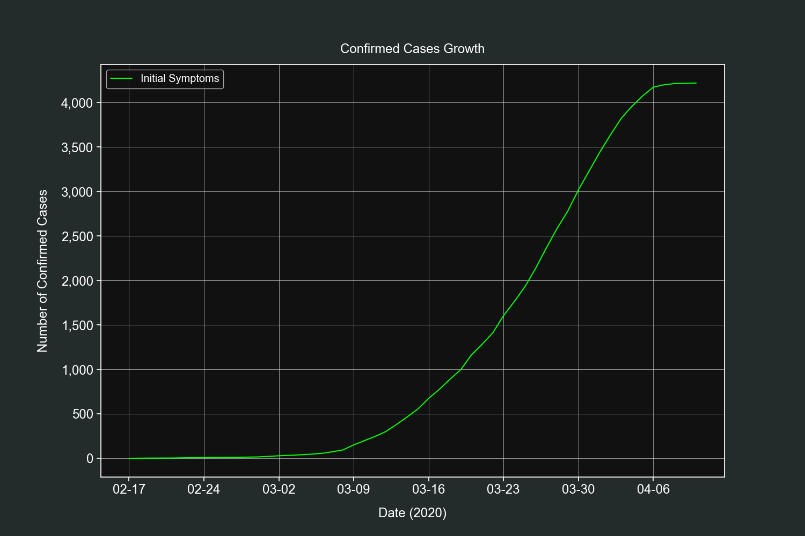
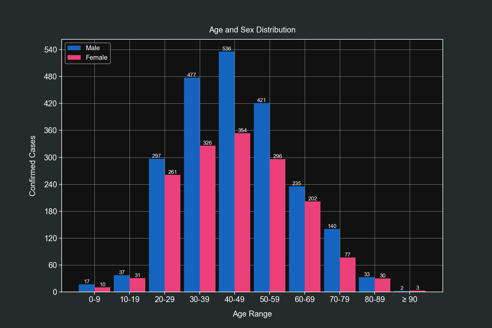

# COVID-19

This project contains scripts that collect and transform datasets of the COVID-19 pandemic for global and Mexican data. It explains the ETL and EDA process.

The following are the summaries of the included scripts:

* step1_global.py - A Python script that downloads and merges datasets from the Johns Hopkins repository.

* step1_mx.py - A Python script that downloads a mexican government PDF file, cleans it and converts it to CSV.

* step2_mx.py - A Python script containing several functions to create plots and get insights from the Mexican dataset.

## Requirements

This project uses the following Python libraries

* requests - For downloading PDF and CSV files.
* BeautifulSoup - For locating the mexican government PDF file.
* PyPDF2 - For reading the mexican government PDF file.
* pandas - For performing Data Analysis.
* NumPy - For fast matrix operations.
* Matplotlib - For creating plots.
* seaborn - Used to prettify Matplotlib plots.

# ETL Process

Data is not always presented in the most optimal way, this is why we need to pass it through a transformation process.

I'm interested in both global and Mexican specific data (my country). Let's start with the global one.

## Global Data

The university of Johns Hopkins provides various datasets that contain global data of the COVID-19 pandemic that are daily updated.

Our goal is to merge the time series datasets into one CSV file.

The first thing to do is to define the CSV urls and their kind.

```python
CSV_FILES = {
    "confirmed": "https://raw.githubusercontent.com/CSSEGISandData/COVID-19/master/csse_covid_19_data/csse_covid_19_time_series/time_series_covid19_confirmed_global.csv",
    "deaths": "https://raw.githubusercontent.com/CSSEGISandData/COVID-19/master/csse_covid_19_data/csse_covid_19_time_series/time_series_covid19_deaths_global.csv",
    "recovered": "https://raw.githubusercontent.com/CSSEGISandData/COVID-19/master/csse_covid_19_data/csse_covid_19_time_series/time_series_covid19_recovered_global.csv"
}
```

These CSV files have the same structure, the columns are the dates and the index are the countries/regions names.

In my experience it is better to have a datetime index than a string one. This is because `pandas` has a great support for datetime indexes.

We have a small problem, we don't know how many columns we will have since they add a new one each day.

What I did is to first 'scout' one of the CSV files and create a skeleton list that will then be filled with the real data.

```python
# Initialize the skeleton list with a header row.
data_list = [["isodate", "country", "confirmed", "deaths", "recovered"]]

# This dictionary will hold all our available dates.
dates_dict = dict()

# This set will hold all the countries/regions we find.
countries = set()

# We will load the first CSV url.
file = list(CSV_FILES.values())[0]

with requests.get(file) as response:
    
    # Pass the response text into a csv.DictReader object.
    reader = csv.DictReader(response.text.splitlines())
    
    # Extract the header row and select from the fifth column onwards.
    fields = reader.fieldnames[4:]

    # Convert the header row dates to datetime objects.
    for field in fields:
        dates_dict[field] = datetime.strptime(field, "%m/%d/%y")

    # Extract the countries/regions by iterating over all rows.
    for row in reader:
        countries.add(row["Country/Region"])

    # Convert the countries set to a list and sort it.
    countries = sorted(list(countries))
    
    # Combine every date with every country and fill it with zero values.
    for date in dates_dict.values():

        for country in countries:
            data_list.append([date, country, 0, 0, 0])
```

Once this code is run we end up having a list similar to this one.

```python
["isodate", "country", "confirmed", "deaths", "recovered"]
[2020-01-22 00:00:00, 'Afghanistan', 0, 0, 0]
[2020-01-22 00:00:00, 'Albania', 0, 0, 0],
[2020-01-22 00:00:00, 'Algeria', 0, 0, 0]
```

Each country will have zero values for each date we find. The drawback is that we will end with several rows with zero values but that's really easy fo filter out with `pandas`.

Once we have our skeleton list ready we can start filling it with real data.

We will load the 3 CSV files and check each row to see if it matches with our skeleton list and then update the corresponding column.

```python
# Iterate over our 3 urls.
for kind, url in CSV_FILES.items():

    with requests.get(url) as response:

        # Pass the response text into a csv.DictReader object.
        reader = csv.DictReader(response.text.splitlines())

        # Iterate over each row of the CSV file.
        for row in reader:

            # Iterate over our available dates.
            for k, v in dates_dict.items():

                # Iterate over our skeleton list.
                for index, item in enumerate(data_list):

                    # If the current skeleton list row matches our CSV row we update its values.
                    if v == item[0] and row["Country/Region"] == item[1]:

                        # Depending on the kind of the CSV data is the column to update.
                        if kind == "confirmed":
                            data_list[index][2] += int(row[k])
                        elif kind == "deaths":
                            data_list[index][3] += int(row[k])
                        elif kind == "recovered":
                            data_list[index][4] += int(row[k])

                        break

# Save our data to a CSV file.
with open("global_data.csv", "w", encoding="utf-8", newline="") as other_file:
    csv.writer(other_file).writerows(data_list)
```

Now we have our CSV file saved on our computer, ready to be analyzed.

This can be done more efficiently with other libraries but I wanted to provide a solution that used the less external dependencies as possible.

## Mexican Data

The Mexican government provides a tabular PDF file containing the information of the confirmed cases of COVID-19.

The goal is to convert that PDF to CSV. There's a library named `tabula-py` that does this really quickly but I found out I needed to install Java to use it.

Instead of that we will use `PyPDF2` and a custom algorithm to identify patterns.

We will start by creating a function that will locate this PDF file and download it to our computer.

We will do a bit web scraping, using the `Requests` and `BeautifulSoup` duo.

```python
with requests.get(URL) as response:

    soup = BeautifulSoup(response.text, "html.parser")

    # Iterate over all the anchor tags.
    for link in soup.find_all("a"):

        # Once we find the one we are interested in, we download it and break the loop.
        if "casos_positivos" in link["href"]:
            print("Downloading PDF file...")

            with requests.get("https://www.gob.mx" + link["href"]) as pdf_response:

                with open("./casos_confirmados.pdf", "wb") as pdf_file:
                    pdf_file.write(pdf_response.content)
                    print("PDF file downloaded.")

```

With our PDF downloaded we now load it using `PyPDF2` and initialize our data list with a header row.

```python
reader = PyPDF2.PdfFileReader(open("./casos_confirmados.pdf", "rb"))

data_list = [["numero_caso", "estado", "sexo",
                  "edad", "fecha_inicio_sintomas", "estatus"]]

# Iterate over each page.
for i in range(reader.numPages):
    print("Processing page:", i+1, "of", reader.numPages)

    # Extract the raw text.
    page_data = reader.getPage(i).extractText()
```

We then start iterating over each page and extract the text. For the most part this PDF file is well formatted but I noticed the resulting CSV file kept having errors.

I found out that CIUDAD DE MEXICO was written in 3 different ways. It has a new line character where it shouldn't be.

With the following dictionary I'm able to locate similar errors and fix them.

```python
FIX_STRINGS = [
    ["CIUDAD DE\n \nMÉXICO", "CIUDAD DE MÉXICO"],
    ["CIUDAD\n \nDE MÉXICO", "CIUDAD DE MÉXICO"],
    ["BAJA\n \nCALIFORNIA", "BAJA CALIFORNIA"],
    ["SAN LUIS\n \nPOTOSÍ", "SAN LUIS POTOSÍ"],
    ["QUINTANA\n \nROO", "QUINTANA ROO"],
    ["Estados\n \nUnidos", "Estados Unidos"]
]

# Fix some small inconsistencies with the text.
for fixer in FIX_STRINGS:
    page_data = page_data.replace(fixer[0], fixer[1])

# Split the text into chunks and remove empty ones.
page_data = [item.replace("\n", "")
                     for item in page_data.split("\n") if item != " "]

page_data = [item for item in page_data if item != ""]
```

At this point we have a list of strings. We removed the blank ones and we only have valid data.

The first page of the PDF file has the header row data, we will add an if statement to ignore it on the first page only.

```python
# Only on the first page the starting chunk is the 10th one.
if i == 0:
    start_index = 9
else:
    start_index = 0

# Iterate over our chunks, 7 at a time (7 columns).
for j in range(start_index, len(page_data), 6):

    # Create a list with the current chunk plus the next five.
    temp_list = page_data[j:j+6]

    # Add the previous list to the data list if it's not incomplete.
    if len(temp_list) == 6:

        # Fix for bad formatted dates.
        if len(temp_list[4]) == 5:
            temp_date = start_time + timedelta(days=int(temp_list[4]))
            temp_list[4] = "{:%d/%m/%Y}".format(temp_date)
```

We took 6 chunks of the PDF data at a time, passed them to our data list and saved that list to CSV using the `csv.writer().writerows()` method.

```python
with open("casos_confirmados.csv", "w", encoding="utf-8", newline="") as csv_file:
    csv.writer(csv_file).writerows(data_list)
    print("PDF converted.")
```

## Data Analysis

Now we have 2 CSV files ready to be analyzed and plotted, `global_data.csv` and `casos_confirmados.csv`.

We are going to use `pandas`, `NumPy`, `matplotlib` and `seaborn`. We will start by importing the required libraries and setting up the styles for our plots.


```python
import matplotlib.dates as mdates
import matplotlib.pyplot as plt
import matplotlib.ticker as ticker
import numpy as np
import pandas as pd
import seaborn as sns


sns.set(style="ticks",
        rc={
            "figure.figsize": [15, 10],
            "text.color": "white",
            "legend.fontsize": "large",
            "xtick.labelsize": "x-large",
            "ytick.labelsize": "x-large",
            "axes.labelsize": "x-large",
            "axes.titlesize": "x-large",
            "axes.labelcolor": "white",
            "axes.edgecolor": "white",
            "xtick.color": "white",
            "ytick.color": "white",
            "axes.facecolor": "#111111",
            "figure.facecolor": "#232b2b"}
        )
```

These styles will apply an elegant dark gray palette to our plots.

Let's start with the global dataset.

*Note: You will have different numbers no your results as I did this analysis on older datasets.*

## Global Data

We start by loading our dataset and specifying the first column as our index, this will turn it into a `datetimeindex` which is very handy when working with time series data.

```python
df = pd.read_csv("global_data.csv", parse_dates=["isodate"], index_col=0)
```

Let's take a look at our `DataFrame` using the `head()`, `tail()` and `describe()` methods.

```python
df.head()
```

| | country | confirmed | deaths |  recovered |
| --- | --- | --- | --- | --- |
| isodate | | | |
| 2020-01-22 | Afghanistan | 0 | 0 | 0 |
| 2020-01-22 | Albania | 0 | 0 | 0 |
| 2020-01-22 | Algeria | 0 | 0 | 0 |
| 2020-01-22 | Andorra | 0 | 0 | 0 |
| 2020-01-22 | Angola | 0 | 0 | 0 |

```python
df.tail()
```

| isodate             | country            |   confirmed |   deaths |   recovered |
|:--------------------|:-------------------|------------:|---------:|------------:|
| 2020-04-14 | West Bank and Gaza |         308 |        2 |          62 |
| 2020-04-14 | Western Sahara     |           6 |        0 |           0 |
| 2020-04-14 | Yemen              |           1 |        0 |           0 |
| 2020-04-14 | Zambia             |          45 |        2 |          30 |
| 2020-04-14 | Zimbabwe           |          17 |        3 |           0 |

```python
df.describe()
```

|       |   confirmed |    deaths |   recovered |
|:------|------------:|----------:|------------:|
| count |    15540    | 15540     |   15540     |
| mean  |     2007.55 |   105.364 |     489.394 |
| std   |    16754    |   998.927 |    4630.27  |
| min   |        0    |     0     |       0     |
| 25%   |        0    |     0     |       0     |
| 50%   |        1    |     0     |       0     |
| 75%   |       53    |     1     |       2     |
| max   |   607670    | 25832     |   78200     |

We can observe the countries are alphabetically sorted and our `datetimeindex` worked correctly.

We can also observe all the first rows have zero values, as predicted from the ETL process. This caused an adverse effect on the `describe()` method, where the results are biased towards zero.

Let's fix this by removing all rows with zero values on their confirmed field.

```python
df = df[df["confirmed"] > 0]
df.describe()
```

|       |   confirmed |    deaths |   recovered |
|:------|------------:|----------:|------------:|
| count |     7793    |  7793     |    7793     |
| mean  |     4003.25 |   210.107 |     975.898 |
| std   |    23490.1  |  1402.83  |    6502.32  |
| min   |        1    |     0     |       0     |
| 25%   |        7    |     0     |       0     |
| 50%   |       52    |     1     |       2     |
| 75%   |      541    |     7     |      32     |
| max   |   607670    | 25832     |   78200     |

This looks better and we can now start getting interesting insights.

We will be applying this same filtering on some of the next sections.

### Top 10 Countries by Confirmed Cases, Deaths & Recoveries

To get the countries with the highest values we first need to group our `DataFrame` by the country field and selecting their max value which happenes to be the latest one.

```python
grouped_df = df.groupby("country").max()
```

Once grouped we use the `sort_values()` method on the field we are intereseted and use the descending order. From there we print the first 10 rows from the field we are interested in.

```python
# Confirmed cases
print(grouped_df.sort_values("confirmed", ascending=False)["confirmed"][:10])
```

| country        |   confirmed |
|:---------------|------------:|
| US             |      607670 |
| Spain          |      172541 |
| Italy          |      162488 |
| France         |      137875 |
| Germany        |      131359 |
| United Kingdom |       94845 |
| China          |       83306 |
| Iran           |       74877 |
| Turkey         |       65111 |
| Belgium        |       31119 |

```python
# Deaths
print(grouped_df.sort_values("deaths", ascending=False)["deaths"][:10])
```

| country        |   deaths |
|:---------------|---------:|
| US             |    25832 |
| Italy          |    21067 |
| Spain          |    18056 |
| France         |    15748 |
| United Kingdom |    12129 |
| Iran           |     4683 |
| Belgium        |     4157 |
| China          |     3345 |
| Germany        |     3294 |
| Netherlands    |     2955 |

```python
# Recoveries
print(grouped_df.sort_values("recovered", ascending=False)["recovered"][:10])
```

| country     |   recovered |
|:------------|------------:|
| China       |       78200 |
| Germany     |       68200 |
| Spain       |       67504 |
| Iran        |       48129 |
| US          |       47763 |
| Italy       |       37130 |
| France      |       29098 |
| Switzerland |       13700 |
| Canada      |        8210 |
| Austria     |        7633 |

### Daily Global Confirmed Cases, Deaths or Recoveries

Thanks fo the `datetimeindex` knowing the daily totals is really easy. We will only require to resample our `DataFrame` by 1 day intervals.

We will start by defining our field (`confirmed`, `deaths` or `recovered`) and resampling method.

```python
field = "deaths"
resampled_df = df.resample("D").sum()
```

We add 2 new columns to know the daily field totals (`difference`) and their percent change (`change`).

```python
resampled_df["difference"] = resampled_df[field].diff()
resampled_df["change"] = resampled_df["difference"].pct_change()
```

Now we drop `NaN` values, we do this so the next step doesn't crash the script.

```python
resampled_df.dropna(inplace=True)
```

This step is optional, the purpose of it is to display the results in a more human readable way.

The `difference` column gets converted from `float` to `int` and the `change` column gets some string formatting, which includes adding a percent sign and rounding up the numbers to the second decimal.

```python
resampled_df["difference"] = resampled_df["difference"].apply(int)

resampled_df["change"] = resampled_df["change"].apply(
    lambda x: str(np.round(x * 100, 2)) + "%")
```

And finally, we print the latest 10 rows.

```python
print(resampled_df[[field, "difference", "change"]][-10:])
```

| isodate             |   deaths |   difference | change   |
|:--------------------|---------:|-------------:|:---------|
| 2020-04-05 |    69374 |         4768 | -18.06%  |
| 2020-04-06 |    74565 |         5191 | 8.87%    |
| 2020-04-07 |    81865 |         7300 | 40.63%   |
| 2020-04-08 |    88338 |         6473 | -11.33%  |
| 2020-04-09 |    95455 |         7117 | 9.95%    |
| 2020-04-10 |   102525 |         7070 | -0.66%   |
| 2020-04-11 |   108503 |         5978 | -15.45%  |
| 2020-04-12 |   114091 |         5588 | -6.52%   |
| 2020-04-13 |   119482 |         5391 | -3.53%   |
| 2020-04-14 |   125984 |         6502 | 20.61%   |

### Daily Confirmed Cases, Deaths or Recoveries for any Country

Now we will know the daily confirmed cases, deaths or recoveries and their growth for any given country. We will use the US for this example.

We start by defining the country and which field we want (`confirmed`, `deaths` or `recovered`). Afterwards we filter our `DataFrame` so it only includes values of that country.

```python
field = "deaths"
country = "US"
filtered_df = df[df["country"] == country].copy()
```

We add 2 new columns to know the daily field totals (`difference`) and their percent change (`change`).

```python
filtered_df["difference"] = filtered_df[field].diff()
filtered_df["change"] = filtered_df["difference"].pct_change()
```

Now we drop `NaN` values, we do this so the next step doesn't crash the script.

```python
filtered_df.dropna(inplace=True)
```

This step is optional, the purpose of it is to display the results in a more human readable way.

The `difference` column gets converted from `float` to `int` and the `change` column gets some string formatting, which includes adding a percent sign and rounding up the numbers to the second decimal.

```python
filtered_df["difference"] = filtered_df["difference"].apply(int)

filtered_df["change"] = filtered_df["change"].apply(
    lambda x: str(np.round(x * 100, 2)) + "%")
```

And finally, we print the latest 10 rows.

```python
print(filtered_df[[field, "difference", "change"]][-10:])
```

| isodate             |   deaths |   difference | change   |
|:--------------------|---------:|-------------:|:---------|
| 2020-04-05 |     9619 |         1212 | -8.18%   |
| 2020-04-06 |    10783 |         1164 | -3.96%   |
| 2020-04-07 |    12722 |         1939 | 66.58%   |
| 2020-04-08 |    14695 |         1973 | 1.75%    |
| 2020-04-09 |    16478 |         1783 | -9.63%   |
| 2020-04-10 |    18586 |         2108 | 18.23%   |
| 2020-04-11 |    20463 |         1877 | -10.96%  |
| 2020-04-12 |    22020 |         1557 | -17.05%  |
| 2020-04-13 |    23529 |         1509 | -3.08%   |
| 2020-04-14 |    25832 |         2303 | 52.62%   |

Feel free to try this with other country names, such as Italy, Spain or Iran.

## Days from 100 to 3200 Confirmed Cases

This one is quite interesting. We will know how many days it took to reach from 100 to 3,200 confirmed cases.

For this exercise we will use custom bins for the exponential growth (100-199, 200-399, and so on).

We start by removing all rows lower than 100.

```python
df = df[df["confirmed"] >= 100]
```

We define our bins and their labels.

```python
bins = [(100, 199), (200, 399), (400, 799), (800, 1599), (1600, 3200)]
labels = ["100-199", "200-399", "400-799", "800-1599", "1600-3200"]
```

We extract all the available countries in the dataset.

```python
all_countries = sorted(df["country"].unique().tolist())
```

These lists will be filled with values in the next step.

```python
valid_countries = list()
data_list = list()
```

We iterate over all the countries we have and create temporary DataFrames with them.

```python
for country in all_countries:

    temp_df = df[df["country"] == country]

    # Only process countries if their confirmed cases are equal or greater than 3,200.
    if temp_df["confirmed"].max() >= 3200:
        temp_list = list()

        # We iterate over our bins and count hoy many days each one has.
        for item in bins:
            temp_list.append(temp_df[(temp_df["confirmed"] >= item[0]) & (
                temp_df["confirmed"] <= item[1])]["confirmed"].count())

        data_list.append(temp_list)
        valid_countries.append(country)
```

We create a final `DataFrame` with the results and a new column with the total days from 100 to 3,200 confirmed cases.

```python
final_df = pd.DataFrame(data_list, index=valid_countries, columns=labels)
final_df["total"] = final_df.sum(axis=1)
print(final_df)
```

|                      |   100-199 |   200-399 |   400-799 |   800-1599 |   1600-3200 |   total |
|:---------------------|----------:|----------:|----------:|-----------:|------------:|--------:|
| Australia            |         3 |         4 |         4 |          2 |           5 |      18 |
| Austria              |         3 |         2 |         2 |          3 |           4 |      14 |
| Belarus              |         3 |         2 |         3 |          3 |           4 |      15 |
| Belgium              |         2 |         5 |         2 |          4 |           3 |      16 |
| Brazil               |         3 |         3 |         2 |          2 |           4 |      14 |
| Canada               |         4 |         1 |         3 |          4 |           2 |      14 |
| Chile                |         1 |         3 |         4 |          3 |           6 |      17 |
| China                |         0 |         0 |         2 |          2 |           2 |       6 |
| Czechia              |         2 |         3 |         2 |          5 |           6 |      18 |
| Denmark              |         0 |         1 |         2 |         11 |           8 |      22 |
| Dominican Republic   |         1 |         4 |         3 |          7 |           9 |      24 |
| Ecuador              |         2 |         1 |         2 |          5 |           6 |      16 |
| France               |         3 |         3 |         1 |          3 |           3 |      13 |
| Germany              |         3 |         1 |         3 |          3 |           2 |      12 |
| India                |         6 |         3 |         4 |          5 |           4 |      22 |
| Indonesia            |         3 |         3 |         5 |          6 |           8 |      25 |
| Iran                 |         1 |         2 |         1 |          2 |           2 |       8 |
| Ireland              |         3 |         2 |         3 |          4 |           5 |      17 |
| Israel               |         3 |         4 |         3 |          3 |           3 |      16 |
| Italy                |         1 |         2 |         2 |          2 |           4 |      11 |
| Japan                |         6 |         8 |         9 |         13 |           9 |      45 |
| Korea, South         |         1 |         1 |         2 |          3 |           3 |      10 |
| Luxembourg           |         1 |         2 |         3 |          4 |          14 |      24 |
| Malaysia             |         5 |         1 |         4 |          5 |          10 |      25 |
| Mexico               |         2 |         4 |         4 |          6 |           6 |      22 |
| Netherlands          |         2 |         3 |         2 |          4 |           4 |      15 |
| Norway               |         3 |         1 |         3 |          6 |           7 |      20 |
| Pakistan             |         1 |         2 |         4 |          7 |           7 |      21 |
| Panama               |         2 |         4 |         4 |          6 |           8 |      24 |
| Peru                 |         2 |         5 |         5 |          6 |           4 |      22 |
| Philippines          |         4 |         5 |         4 |          4 |           5 |      22 |
| Poland               |         3 |         3 |         4 |          4 |           6 |      20 |
| Portugal             |         2 |         2 |         3 |          2 |           4 |      13 |
| Qatar                |         0 |         4 |        17 |          4 |           8 |      33 |
| Romania              |         4 |         4 |         3 |          4 |           6 |      21 |
| Russia               |         3 |         3 |         3 |          4 |           3 |      16 |
| Saudi Arabia         |         5 |         3 |         3 |          7 |           8 |      26 |
| Serbia               |         3 |         5 |         4 |          4 |           7 |      23 |
| Singapore            |        13 |         8 |         7 |         11 |           6 |      45 |
| Spain                |         2 |         2 |         3 |          1 |           3 |      11 |
| Sweden               |         2 |         3 |         2 |          7 |           8 |      22 |
| Switzerland          |         1 |         4 |         3 |          2 |           4 |      14 |
| Turkey               |         1 |         1 |         1 |          2 |           2 |       7 |
| US                   |         2 |         2 |         3 |          2 |           3 |      12 |
| Ukraine              |         2 |         2 |         4 |          6 |           6 |      20 |
| United Arab Emirates |         6 |         3 |         5 |          4 |           5 |      23 |
| United Kingdom       |         2 |         4 |         2 |          4 | 

## Mexican Data

We start by loading our dataset and specifying the fifth column (`fecha_inicio_sintomas`) as datetime.

```python
df = pd.read_csv("casos_confirmados.csv", index_col=0, parse_dates=[
                          "fecha_inicio_sintomas"], dayfirst=True)
```

Let's take a look at our `DataFrame` using the `head()`, `tail()` and `describe()` methods.

```python
df.head()
```

|   numero_caso | estado           | sexo      |   edad | fecha_inicio_sintomas   | estatus    |
|--------------:|:-----------------|:----------|-------:|:------------------------|:-----------|
|             1 | MÉXICO           | FEMENINO  |     75 | 2020-03-28 00:00:00     | Confirmado |
|             2 | TAMAULIPAS       | MASCULINO |     22 | 2020-04-04 00:00:00     | Confirmado |
|             3 | CIUDAD DE MÉXICO | MASCULINO |     40 | 2020-03-17 00:00:00     | Confirmado |
|             4 | CIUDAD DE MÉXICO | FEMENINO  |     29 | 2020-03-26 00:00:00     | Confirmado |
|             5 | GUERRERO         | FEMENINO  |     61 | 2020-04-06 00:00:00     | Confirmado |

```python
df.tail()
```

|   numero_caso | estado           | sexo      |   edad | fecha_inicio_sintomas   | estatus    |
|--------------:|:-----------------|:----------|-------:|:------------------------|:-----------|
|          3840 | MÉXICO           | MASCULINO |     61 | 2020-03-14 00:00:00     | Confirmado |
|          3841 | MÉXICO           | FEMENINO  |     28 | 2020-03-26 00:00:00     | Confirmado |
|          3842 | CIUDAD DE MÉXICO | FEMENINO  |     62 | 2020-03-18 00:00:00     | Confirmado |
|          3843 | CAMPECHE         | FEMENINO  |     32 | 2020-03-31 00:00:00     | Confirmado |
|          3844 | PUEBLA           | FEMENINO  |     66 | 2020-03-15 00:00:00     | Confirmado |

```python
df.describe()
```

|       |      edad |
|:------|----------:|
| count | 3844      |
| mean  |   45.4389 |
| std   |   15.8237 |
| min   |    0      |
| 25%   |   33      |
| 50%   |   45      |
| 75%   |   56      |
| max   |  102      |

We have 5 columns, state, age, gender, date of initial symptoms and status. We will work with the first four and discard the last one since it has the same value for all rows.

It is very important to note that the column of date of initial symptoms is not a confirmed cases date. That data is not available in this dataset but it is available on the global one.

### Confirmed Cases by State

Mexico has 32 states and as of now all of them have confirmed cases.

To know how many cases each state has we use the `value_counts()` method on the `estado` column.

```python
print(df["estado"].value_counts())
```

|                     |   estado |
|:--------------------|---------:|
| CIUDAD DE MÉXICO    |     1117 |
| MÉXICO              |      498 |
| BAJA CALIFORNIA     |      278 |
| PUEBLA              |      243 |
| QUINTANA ROO        |      216 |
| SINALOA             |      214 |
| COAHUILA            |      156 |
| JALISCO             |      150 |
| TABASCO             |      143 |
| NUEVO LEÓN          |      119 |
| YUCATÁN             |      103 |
| BAJA CALIFORNIA SUR |      102 |
| GUANAJUATO          |       81 |
| VERACRUZ            |       73 |
| SONORA              |       65 |
| QUERETARO           |       57 |
| GUERRERO            |       56 |
| AGUASCALIENTES      |       55 |
| CHIHUAHUA           |       54 |
| HIDALGO             |       53 |
| SAN LUIS POTOSÍ     |       51 |
| MICHOACÁN           |       50 |
| TAMAULIPAS          |       49 |
| OAXACA              |       43 |
| MORELOS             |       40 |
| CHIAPAS             |       39 |
| TLAXCALA            |       38 |
| NAYARIT             |       21 |
| CAMPECHE            |       18 |
| DURANGO             |       16 |
| ZACATECAS           |       14 |
| COLIMA              |        7 |

The state with most cases is the capital of the country (Mexico City).

That was really simple, let's up our game and do some table pivoting and MultiIndex calculations.

We will use this value to calculate the percentages.

```python
total_cases = len(df)
```

We pivot the table, we will use the gender as our columns and the state as our index.

```python
pivoted_df = df.pivot_table(
    index="estado", columns="sexo", aggfunc="count")
```

From this MultiIndex `DataFrame` we will add two columns to the age column. These columns will have the total percentage of each state and gender.

```python
pivoted_df["edad", "female_percentage"] = np.round(
    pivoted_df["edad", "FEMENINO"] / total_cases * 100, 2)

pivoted_df["edad", "male_percentage"] = np.round(
    pivoted_df["edad", "MASCULINO"] / total_cases * 100, 2)
```

We rename the columns so they are human readable.

```python
pivoted_df.rename(columns={"MASCULINO": "Male",
                            "FEMENINO": "Female",
                            "male_percentage": "Male %",
                            "female_percentage": "Female %"}, level=1, inplace=True)

print(pivoted_df["edad"])
```

| estado              |   Female |   Male |   Female % |   Male % |
|:--------------------|---------:|-------:|-----------:|---------:|
| AGUASCALIENTES      |       29 |     26 |       0.69 |     0.62 |
| BAJA CALIFORNIA     |      126 |    152 |       2.99 |     3.6  |
| BAJA CALIFORNIA SUR |       47 |     55 |       1.11 |     1.3  |
| CAMPECHE            |        5 |     13 |       0.12 |     0.31 |
| CHIAPAS             |       10 |     29 |       0.24 |     0.69 |
| CHIHUAHUA           |       19 |     35 |       0.45 |     0.83 |
| CIUDAD DE MÉXICO    |      436 |    681 |      10.33 |    16.14 |
| COAHUILA            |       69 |     87 |       1.64 |     2.06 |
| COLIMA              |        3 |      4 |       0.07 |     0.09 |
| DURANGO             |        7 |      9 |       0.17 |     0.21 |
| GUANAJUATO          |       43 |     38 |       1.02 |     0.9  |
| GUERRERO            |       20 |     36 |       0.47 |     0.85 |
| HIDALGO             |       19 |     34 |       0.45 |     0.81 |
| JALISCO             |       58 |     92 |       1.37 |     2.18 |
| MICHOACÁN           |       20 |     30 |       0.47 |     0.71 |
| MORELOS             |       19 |     21 |       0.45 |     0.5  |
| MÉXICO              |      214 |    284 |       5.07 |     6.73 |
| NAYARIT             |       14 |      7 |       0.33 |     0.17 |
| NUEVO LEÓN          |       38 |     81 |       0.9  |     1.92 |
| OAXACA              |       22 |     21 |       0.52 |     0.5  |
| PUEBLA              |      117 |    126 |       2.77 |     2.99 |
| QUERETARO           |       26 |     31 |       0.62 |     0.73 |
| QUINTANA ROO        |       71 |    145 |       1.68 |     3.44 |
| SAN LUIS POTOSÍ     |       25 |     26 |       0.59 |     0.62 |
| SINALOA             |       90 |    124 |       2.13 |     2.94 |
| SONORA              |       33 |     32 |       0.78 |     0.76 |
| TABASCO             |       73 |     70 |       1.73 |     1.66 |
| TAMAULIPAS          |       22 |     27 |       0.52 |     0.64 |
| TLAXCALA            |       17 |     21 |       0.4  |     0.5  |
| VERACRUZ            |       33 |     40 |       0.78 |     0.95 |
| YUCATÁN             |       47 |     56 |       1.11 |     1.33 |
| ZACATECAS           |        5 |      9 |       0.12 |     0.21 |

And now we have a more complete and useful table of summaries.

### Confirmed Cases Daily Growth

Let's start our plots section with a simple one. This plot will show us the daily progression of the pandemic in Mexico.

Remember that this dataset does not contain the dates when the cases were confirmed, it contains the date when the symptoms first appeared. Let's see what we will get.

We group our `DataFrame` by day of initial symptoms and aggregate them by number of ocurrences.

```python
grouped_df = df.groupby("fecha_inicio_sintomas").count()
```

We add a new column that will hold the cumulative sum of the previous counts.

```python
grouped_df["cumsum"] = grouped_df["estado"].cumsum()
```

We create a basic line plot with the previously created column.

```python
fig, ax = plt.subplots()

ax.plot(grouped_df.index, grouped_df["cumsum"],
        label="Initial Symptoms", color="lime")
```

Customize the tickers. The y-axis will be formatted with date and month in 7 day intervals.

```python
ax.xaxis.set_major_locator(mdates.DayLocator(interval=7))
ax.xaxis.set_major_formatter(mdates.DateFormatter("%m-%d"))
ax.yaxis.set_major_locator(ticker.MaxNLocator())
ax.yaxis.set_major_formatter(ticker.StrMethodFormatter("{x:,.0f}"))
```

Add final customizations.

```python
plt.title("Confirmed Cases Growth", pad=15)
plt.legend(loc=2)
plt.grid(linewidth=0.5)
plt.xlabel("Date (2020)", labelpad=15)
plt.ylabel("Number of Confirmed Cases", labelpad=15)

plt.show()
```



For what it's worth it resembles the confirmed cases curve. Thankfully we have the data to plot the daily confirmed cases in the global dataset.

### Age and Sex Distribution

Knowing the age groups is very important and for this exercise we will bin our data and then group it by gender. We will use custom bins that wlil  hold values in steps of 10 (0-9, 10-19, 20-29 and so on.).

On the 90-99 bin we will make an exception and define it has 90-120 since that age group has the least values of them all.

We start by cCreating one `DataFrame` for each gender.

```python
male_df = df[df["sexo"] == "MASCULINO"]
female_df = df[df["sexo"] == "FEMENINO"]
```

We then define 2 lists that will be used for our bins.

```python
age_groups = list()
labels = list()
```

We start a loop from 0 to 100 with steps of 10. This will fill our previous 2 lists.

```python
for i in range(0, 100, 10):

    # Our latest bin will be for ages >= 90.
    if i == 90:
        age_groups.append((i, i+30))
        labels.append("≥ 90")
    else:
        age_groups.append((i, i+9))
        labels.append("{}-{}".format(i, i+9))
```

We build our indexer and cut our `DataFrames` with it.

```python
bins = pd.IntervalIndex.from_tuples(age_groups)

male_df = male_df.groupby(pd.cut(male_df["edad"], bins)).count()
female_df = female_df.groupby(pd.cut(female_df["edad"], bins)).count()
```

We create a 2 bar plots in the same axis, each plot will have the values for their respective `DataFrame`.

```python
fig, ax = plt.subplots()

bars = ax.bar(
    [i - 0.225 for i in range(len(labels))], height=male_df["edad"],  width=0.45,  color="#1565c0", linewidth=0)

# This loop creates small texts with the absolute values above each bar (first set of bars).
for bar in bars:
    height = bar.get_height()

    plt.text(bar.get_x() + bar.get_width()/2.0, height,
                "{:,}".format(height), ha="center", va="bottom")

bars2 = ax.bar(
    [i + 0.225 for i in range(len(labels))], height=female_df["edad"],  width=0.45,  color="#ec407a", linewidth=0)

# This loop creates small texts with the absolute values above each bar (second set of bars).
for bar2 in bars2:
    height2 = bar2.get_height()

    plt.text(bar2.get_x() + bar2.get_width()/2.0, height2,
                "{:,}".format(height2), ha="center", va="bottom")

```

Customize our tickers.

```python
ax.yaxis.set_major_locator(ticker.MaxNLocator())
ax.yaxis.set_major_formatter(ticker.StrMethodFormatter("{x:,.0f}"))
```

Add final customizations.

```python
plt.title("Age and Sex Distribution", pad=15)
plt.legend(["Male", "Female"], loc=2)
plt.grid(linewidth=0.5)
plt.xticks(range(len(labels)), labels)
plt.xlabel("Age Range", labelpad=15)
plt.ylabel("Confirmed Cases", labelpad=15)

plt.show()
```



We can observe that most cases fall within the 30-60 age range and men have most registered cases than women in almost all age groups.

And that's it for this dataset. We got as much information as we could from the four usable fields we had (state, age, gender and initial symptoms date).

This dataset used to have 2 other fields; country of procedence and arrival date but they were removed for no reason.

## Conclusion

Getting clean data is not always easy and can discourage people from doing their own analysis. That's why I wanted to shore these scripts with you so you can accelerate your workflow and get interesting insights.

There's still more to come!